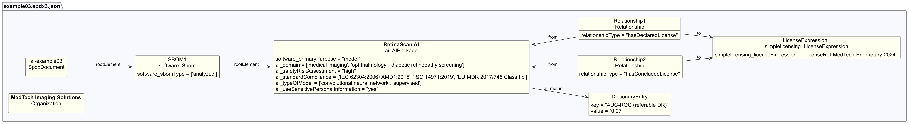

# AI example 3 - Medical AI with safety classification

## Description

This example illustrates an SBOM for a medical AI model that analyzes eye
images to assess disease severity.

The SBOM demonstrates AI-profile properties relevant to
**high-risk regulated AI systems**, covering safety classification,
regulatory compliance, explainability, and sensitive data handling.

## Profile conformance

`core`, `ai`

## SPDX files

| Version | File |
| ------- | ---- |
| SPDX 3.0 | [spdx3.0/example03.spdx3.json](./spdx3.0/example03.spdx3.json) |

## Key properties demonstrated

| Property | Notes |
| -------- | ----- |
| `/AI/limitation` | Out-of-scope equipment, pediatric patients |
| `/AI/modelExplainability` | Methods for interpreting model decisions |
| `/AI/safetyRiskAssessment` | `high` |
| `/AI/standardCompliance` | IEC 62304, ISO 14971, EU MDR 2017/745 |
| `/AI/typeOfModel` | convolutional neural network, supervised |
| `/AI/useSensitivePersonalInformation` | `yes` - processes patient medical imagery |
