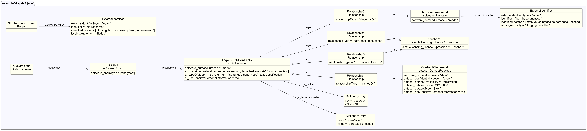

# AI example 4 - Fine-tuned language model with reproducibility metadata

## Description

This example illustrates an SBOM for a language model fine-tuned to classify
clauses in legal contracts.

The SBOM demonstrates AI-profile and Dataset-profile properties relevant to
**model reproducibility and lifecycle tracking**, including hyperparameters,
data preprocessing, explainability methods, and dataset size documentation.
The embedded `DatasetPackage` (`ContractClauses-v2`) shows dataset
documentation alongside the model.

## Profile conformance

`core`, `ai`, `dataset`

## SPDX files

| Version | File |
| ------- | ---- |
| SPDX 3.0 | [spdx3.0/example04.spdx3.json](./spdx3.0/example04.spdx3.json) |
| SPDX 3.1 (draft) | [spdx3.1/example04.spdx3.json-draft](./spdx3.1/example04.spdx3.json-draft) |

## Key properties demonstrated

| Property / Relationship | Notes |
| ----------------------- | ----- |
| `/AI/hyperparameter` | Training settings (learning rate, epochs, optimizer, seed, precision, ...) |
| `/AI/modelExplainability` | Methods for interpreting model output |
| `/AI/typeOfModel` | transformer, fine-tuned, supervised |
| `/Dataset/datasetSize` | 524288000 bytes (~500 MB) - deprecated in SPDX 3.1, use `/Software/artifactSize` |
| `dependsOn` | Fine-tuned model → base model; in SPDX 3.1, use `finetunedOn` |
| `trainedOn` | Model → ContractClauses-v2 dataset |
