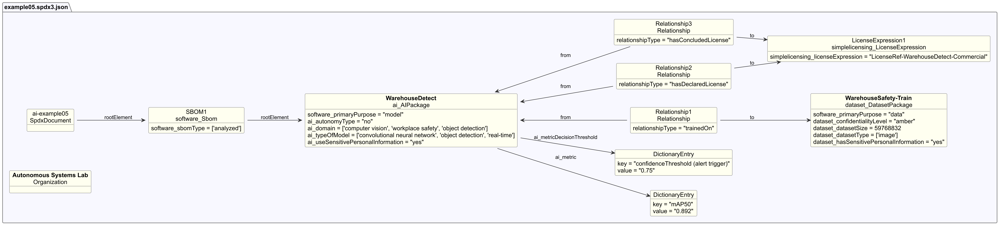

# AI example 5 - Object detection model with performance metrics

## Description

This example illustrates an SBOM for an object detection model deployed on
edge devices to monitor safety in a physical workspace.

The SBOM demonstrates AI-profile properties relevant to
**model evaluation and deployment decisions**, covering performance metrics,
detection thresholds, autonomy level, and training dataset sensitivity
documentation.

## Profile conformance

`core`, `ai`, `dataset`

## SPDX files

| Version | File |
| ------- | ---- |
| SPDX 3.0 | [spdx3.0/example05.spdx3.json](./spdx3.0/example05.spdx3.json) |
| SPDX 3.1 (draft) | [spdx3.1/example05.spdx3.json-draft](./spdx3.1/example05.spdx3.json-draft) |

## Key properties demonstrated

| Property | Notes |
| -------- | ----- |
| `/AI/autonomyType` | `no` (humans make final decisions) - deprecated in SPDX 3.1, use `isoAutomationLevel: partialAutomation` |
| `/AI/metric` | Accuracy, detection quality, and latency scores |
| `/AI/metricDecisionThreshold` | Confidence and overlap thresholds for triggering detections |
| `/Dataset/confidentialityLevel` | `amber` |
| `/Dataset/datasetSize` | Training dataset size - deprecated in SPDX 3.1, use `/Software/artifactSize` |
| `/Dataset/hasSensitivePersonalInformation` | `yes` - training images contain people |
