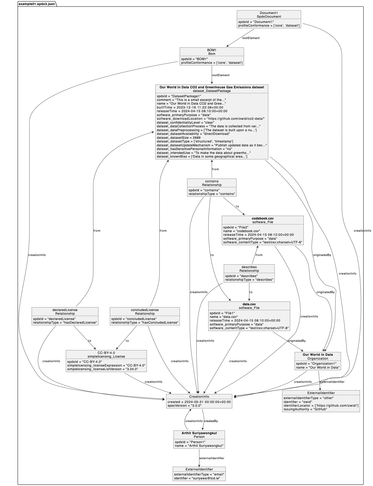

# Example 01

## Description

An example of a simple dataset in tabular format.

```text
content
├── codebook.csv
└── data.csv
```

Both `codebook.csv` and `data.csv` are plain text files in CSV (comma-separated
values) format.

The file `data.csv` contains records of gas emission data for each year in a
country. It has a header on the first line that defines the column names.
Each record consists mostly of numerical data with some categorical data.

The file `codebook.csv` contains the column names from the header of
`data.csv`, together with their description, unit, and source.

The content of this example is an excerpt of the Our World in Data CO2 and
Greenhouse Gas Emissions dataset. It is available in full, under Creative
Commons Attribution 4.0 International License, at
<https://github.com/owid/co2-data/>.

This simplified
[Unified Modeling Language (UML)](https://en.wikipedia.org/wiki/Unified_Modeling_Language)
class diagram illustrates Example 01.  Long string values are truncated and the
spdxIds are shortened (by removing the UUID suffix), for brevity.

[](./spdx3.0/example01.png)
