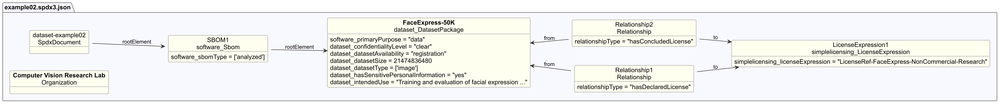

# Dataset example 2 - Image dataset

## Description

This example illustrates an SBOM for a labeled image dataset of human faces
used to train models that recognize facial expressions.

The SBOM demonstrates Dataset-profile properties for **image datasets**,
including data collection, preprocessing, known bias, and privacy sensitivity.

## Profile conformance

`core`, `dataset`

## SPDX files

| Version | File |
| ------- | ---- |
| SPDX 3.0 | [spdx3.0/example02.spdx3.json](./spdx3.0/example02.spdx3.json) |
| SPDX 3.1 (draft) | [spdx3.1/example02.spdx3.json-draft](./spdx3.1/example02.spdx3.json-draft) |

## Key properties demonstrated

| Property | Notes |
| ---------- | ------- |
| `/Dataset/confidentialityLevel` | `clear` - freely distributable (with license) |
| `/Dataset/dataCollectionProcess` | How the images were sourced |
| `/Dataset/dataPreprocessing` | Steps applied to prepare images before use |
| `/Dataset/datasetSize` | `21474836480` bytes (~20 GB) - deprecated in SPDX 3.1, use `/Software/artifactSize` |
| `/Dataset/datasetType` | `image` |
| `/Dataset/hasSensitivePersonalInformation` | `yes` - dataset contains images of people |
| `/Dataset/intendedUse` | Training/evaluation use cases - deprecated in SPDX 3.1, use `/Core/intendedUse` |
| `/Dataset/knownBias` | Demographic imbalances documented |
