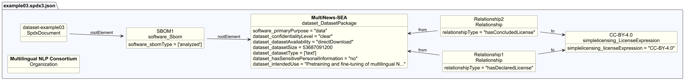

# Dataset example 3 - Multilingual text corpus

## Description

This example illustrates an SBOM for a large text dataset of news articles in
multiple languages, intended for training and evaluating language models.

The SBOM demonstrates Dataset-profile properties for **text corpora**,
covering data collection, preprocessing, update mechanism, known bias, and size documentation.
In SPDX 3.0, language information can only be recorded in free-text `description`
or `comment` fields; SPDX 3.1 introduces the `inLanguage` property
(BCP 47 language tags) to address this gap directly.

## Profile conformance

`core`, `dataset`

## SPDX files

| Version | File |
| ------- | ---- |
| SPDX 3.0 | [spdx3.0/example03.spdx3.json](./spdx3.0/example03.spdx3.json) |
| SPDX 3.1 (draft) | [spdx3.1/example03.spdx3.json-draft](./spdx3.1/example03.spdx3.json-draft) |

## Key properties demonstrated

| Property | Notes |
| -------- | ----- |
| `/Dataset/dataCollectionProcess` | How text was gathered and selected |
| `/Dataset/dataPreprocessing` | Steps applied to clean and filter the text |
| `/Dataset/datasetSize` | `53687091200` bytes (~50 GB) - deprecated in SPDX 3.1, use `/Software/artifactSize` |
| `/Dataset/datasetType` | `text` |
| `/Dataset/datasetUpdateMechanism` | Annual incremental releases |
| `/Dataset/intendedUse` | Language model training and benchmarking - deprecated in SPDX 3.1, use `/Core/intendedUse` |
| `/Dataset/knownBias` | Imbalances in sources and language coverage documented |
| `inLanguage` | `["th", "id", "vi", "fil", "ms"]` - new in SPDX 3.1, records the language(s) of a dataset |
