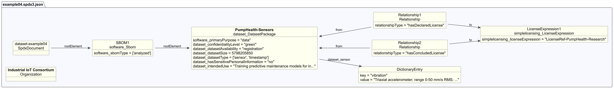

# Dataset example 4 - Sensor and time series data

## Description

This example illustrates an SBOM for a dataset of sensor readings collected
from industrial equipment, used to train models that predict when maintenance
is needed.

The SBOM demonstrates Dataset-profile properties for
**sensor and time series datasets**, including collection process,
multiple dataset types, update mechanism, known bias, and access controls.

## Profile conformance

`core`, `dataset`

## SPDX files

| Version | File |
| ------- | ---- |
| SPDX 3.0 | [spdx3.0/example04.spdx3.json](./spdx3.0/example04.spdx3.json) |
| SPDX 3.1 (draft) | [spdx3.1/example04.spdx3.json-draft](./spdx3.1/example04.spdx3.json-draft) |

## Key properties demonstrated

| Property | Notes |
| -------- | ----- |
| `/Dataset/confidentialityLevel` | `green` - data may be shared within a defined partner community |
| `/Dataset/dataCollectionProcess` | How sensor readings were recorded and labeled |
| `/Dataset/datasetSize` | `5798205850` bytes (~5.4 GB) - deprecated in SPDX 3.1, use `/Software/artifactSize` |
| `/Dataset/datasetType` | `sensor`, `timestamp` - multiple types combined; `sensor` = physical readings, `timestamp` = time-indexed records |
| `/Dataset/datasetUpdateMechanism` | Quarterly appended snapshots |
| `/Dataset/hasSensitivePersonalInformation` | `no` |
| `/Dataset/intendedUse` | Research use cases - deprecated in SPDX 3.1, use `/Core/intendedUse` |
| `/Dataset/knownBias` | Gaps in equipment and failure type coverage documented |
| `/Dataset/sensor` | 8 sensor types as key-value pairs: sensor name → calibration and range description |
