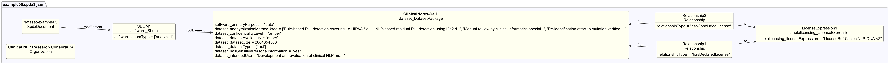

# Dataset example 5 - Sensitive personal data (clinical notes)

## Description

This example illustrates an SBOM for a dataset of de-identified medical notes
from a hospital, used for text analysis research.

The SBOM demonstrates Dataset-profile properties for
**datasets containing sensitive personal information**, covering anonymization
methods, access controls, availability mode, and research use restrictions.

## Profile conformance

`core`, `dataset`

## SPDX files

| Version | File |
| ------- | ---- |
| SPDX 3.0 | [spdx3.0/example05.spdx3.json](./spdx3.0/example05.spdx3.json) |
| SPDX 3.1 (draft) | [spdx3.1/example05.spdx3.json-draft](./spdx3.1/example05.spdx3.json-draft) |

## Key properties demonstrated

| Property | Notes |
| -------- | ----- |
| `/Dataset/anonymizationMethodUsed` | Multi-step process to remove identifying information |
| `/Dataset/confidentialityLevel` | `amber` - access restricted to approved research organizations under data use agreements |
| `/Dataset/datasetAvailability` | `query` - accessible only via a controlled interface, not direct download |
| `/Dataset/datasetSize` | `2684354560` bytes (~2.5 GB) - deprecated in SPDX 3.1, use `/Software/artifactSize` |
| `/Dataset/hasSensitivePersonalInformation` | `yes` - originates from patient health records |
| `/Dataset/intendedUse` | Research use only - deprecated in SPDX 3.1, use `/Core/intendedUse` |
| `/Dataset/knownBias` | Single-institution patient population documented |
| `/Core/inLanguage` | `"en"` - new in SPDX 3.1, records the language(s) of a dataset |
