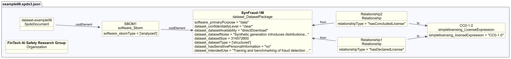

# Dataset example 6 - Synthetic dataset

## Description

This example illustrates an SBOM for a fully synthetic dataset of generated
financial transactions, created for fraud detection research where real
transaction data cannot be shared for privacy reasons.

The SBOM demonstrates Dataset-profile properties for
**synthetically generated datasets**, covering generation methodology,
noise characteristics, dataset type, and access controls.

## Profile conformance

`core`, `dataset`

## SPDX files

| Version | File |
| ------- | ---- |
| SPDX 3.0 | [spdx3.0/example06.spdx3.json](./spdx3.0/example06.spdx3.json) |
| SPDX 3.1 (draft) | [spdx3.1/example06.spdx3.json-draft](./spdx3.1/example06.spdx3.json-draft) |

## Key properties demonstrated

| Property | Notes |
| -------- | ----- |
| `/Dataset/confidentialityLevel` | `clear` - freely distributable (CC0-1.0) |
| `/Dataset/dataCollectionProcess` | Generation methodology documented (not collection) |
| `/Dataset/datasetNoise` | Known limitations of synthetic generation |
| `/Dataset/datasetSize` | `314572800` bytes (~300 MB) - deprecated in SPDX 3.1, use `/Software/artifactSize` |
| `/Dataset/datasetType` | `structured` (tabular) |
| `/Dataset/hasSensitivePersonalInformation` | `no` - synthetic data contains no real customer records |
| `/Dataset/intendedUse` | Research only, not production deployment - deprecated in SPDX 3.1, use `/Core/intendedUse` |
