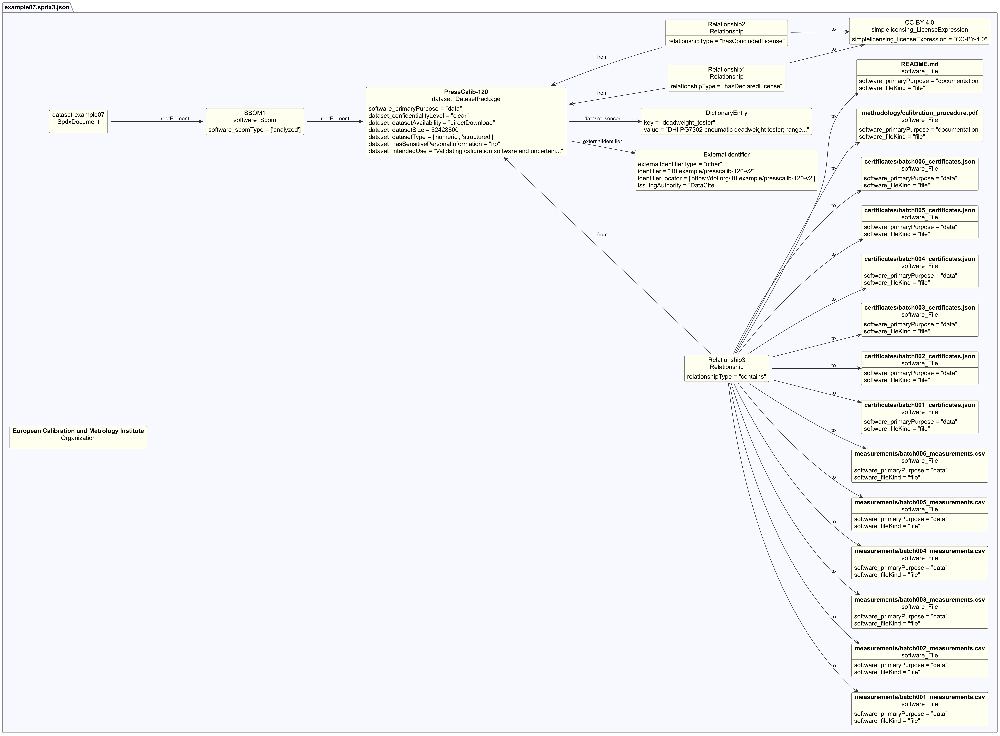

# Dataset example 7 - Calibration dataset

## Description

This example illustrates an SBOM for a calibration dataset: measurement
records from testing 120 industrial pressure sensors against a certified
reference standard. Calibration datasets are used by laboratories and
manufacturers to verify that instruments measure correctly.

The dataset (~50 MB, CSV + JSON) is published openly under CC-BY-4.0 with a
DOI, which motivates using `externalIdentifier` to record the persistent
citation reference.

Because the data was collected using reference instruments (deadweight tester,
thermometer, barometer, humidity sensor), `/Dataset/sensor` documents those
instruments and their calibration specifications - distinct from the 120
pressure sensors being tested.

## Profile conformance

`core`, `dataset`

## SPDX files

| Version | File |
| ------- | ---- |
| SPDX 3.0 | [spdx3.0/example07.spdx3.json](./spdx3.0/example07.spdx3.json) |
| SPDX 3.1 (draft) | [spdx3.1/example07.spdx3.json-draft](./spdx3.1/example07.spdx3.json-draft) |

## Key properties demonstrated

| Property | Notes |
| -------- | ----- |
| `/Dataset/confidentialityLevel` | `clear` - openly published under CC-BY-4.0 |
| `/Dataset/dataCollectionProcess` | Accreditation standard (ISO/IEC 17025) and measurement protocol (EURAMET cg-17 v4) |
| `/Dataset/datasetSize` | `52428800` bytes (~50 MB) - deprecated in SPDX 3.1, use `/Software/artifactSize` |
| `/Dataset/datasetType` | `numeric`, `structured` - tabular numerical measurement records |
| `/Dataset/datasetUpdateMechanism` | Annual re-certification adds new sensors; historical records unchanged |
| `/Dataset/hasSensitivePersonalInformation` | `no` |
| `/Dataset/intendedUse` | Software validation, accreditation audits, education - deprecated in SPDX 3.1, use `/Core/intendedUse` |
| `/Dataset/knownBias` | Single-site elevation effect on absolute sensors; limited to three sensor manufacturers |
| `/Dataset/sensor` | 4 reference instruments used during data collection, with model and uncertainty details |
| `/Software/File` + `contains` | 14 files inside the package: 6 CSV measurement batches, 6 JSON certificate batches, 1 PDF methodology report, 1 README |
| `/Software/File/contentType` | IANA media type per file: `text/csv`, `application/json`, `application/pdf`, `text/markdown` |
| `externalIdentifier` | DOI assigned by DataCite for persistent citation |
