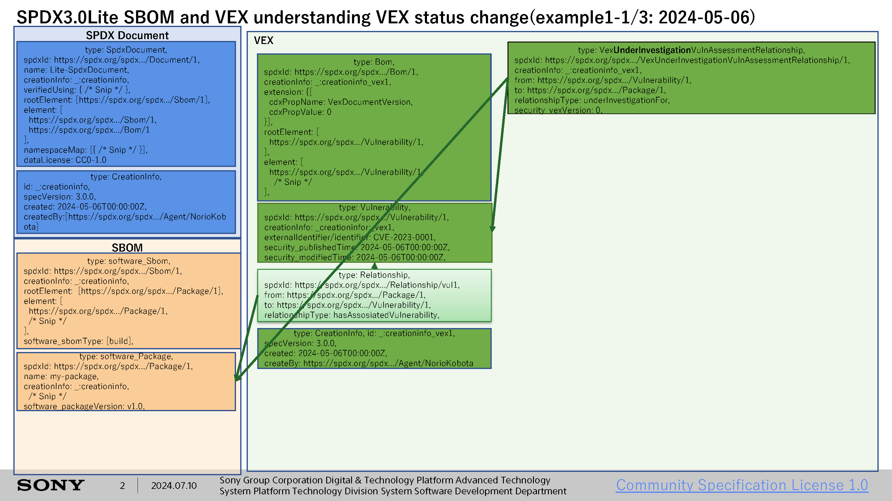
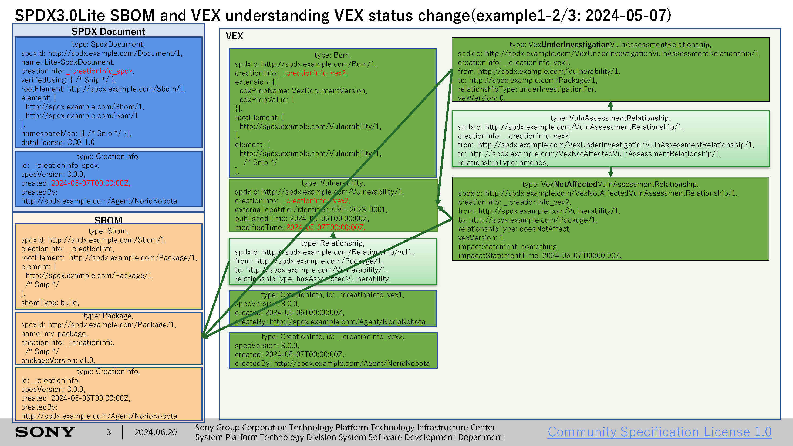
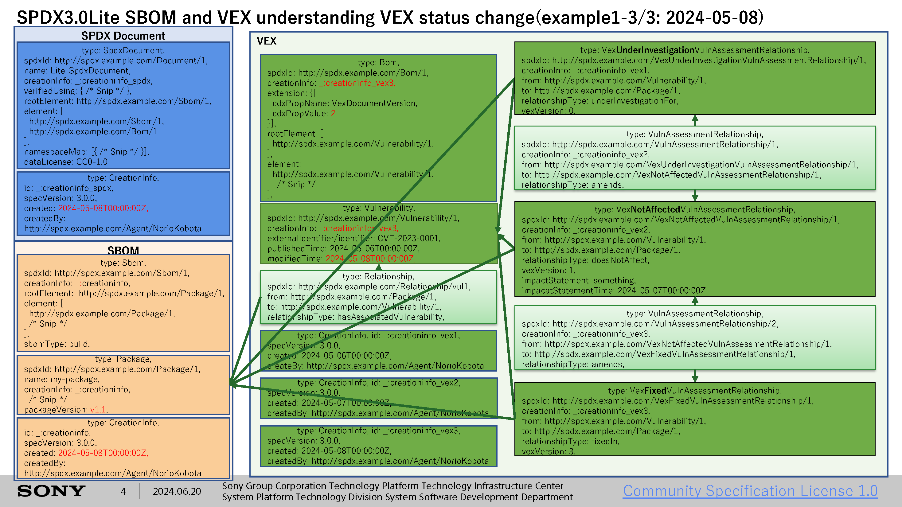

# Lite/Example 1 with Security Profile(VEX)

## Description

This is a JSON-LD file provided using Lite profile when providing Package1, a software package provided under the MIT license.
And Security Profile(Minimum Requirement VEX) information is added.
Package1 has one vulnerability, CVE-1234-1234.
This sample contains 3 files to show the VEX status transition.
The trasition is as follows:
1. UnderInvestigation: Lite-example-1-1-with-VEX.spdx.json
   
2. Affected: Lite-example-1-2-with-VEX.spdx.json
   
3. Fixed: Lite-example-1-3-with-VEX.spdx.json
    

```
Supplier ---> Receiver
 |
 +- Package1 (MIT license)  
```

## Comments
There is no property to describe "2.2.1 Document ID" in [Minimum Requirements for Vulnerability Exploitability eXchange (VEX)](https://www.cisa.gov/resources-tools/resources/minimum-requirements-vulnerability-exploitability-exchange-vex) in the current SPDX3.0 specification.
Therefore, in this sample, "2.2.1 Document ID" is described in property "extesion" in Element class.
