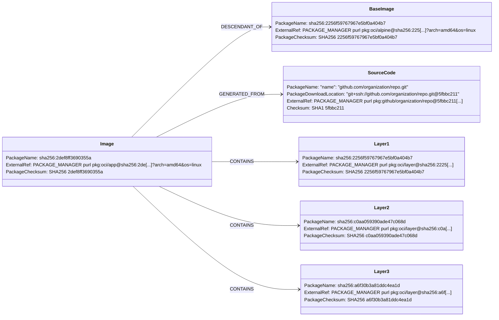

# Containers: Container Image

## Design Goals

* Separation of layers to ensure OS dependencies and app data can be
appended to the approiate layer
* Separation of layers to be able to reuse them, for example when
describing images  sharing the same base image.
* No registry or repository information in `PackageName` to ensure SBOM
is portable as image is copied across registries.
* Layer identification metadata encapsulated in purl external reference[^1]
* Ensure tools can differentiate which packages represent the image layers
from the packages representing both the source code of the image and the
base images.
[^1]: This design uses a proposed `os` field in the `oci` purl type which
[has been proposed](https://github.com/package-url/purl-spec/pull/179) but
still waiting to be merged.

## Structure Diagram

## Design Specification

The goal of this design is to allow maximum flexibility when adding metadata
to the image components.

### Package Structure

The top level package represents the container image and references its manifest.
The name of the package should be the digest of the image manifest, preceded as
usual by the algorithm, eg `sha256:923784e51e709f...`.

The image package can con contain three types of packages:

#### Container Layer

Each of the image layers hould be represented in a package. Ideally, the image
SBOM should describe the whole container image structure. Just as the image,
layers should also be named using their digests. The can layer can contain a
purl of type OCI to reference it.

#### Base Image

Images often are derived from other images. When the described image uses as a 
base another image, the SBOM can reference it using a package. In order to ensure
that tools can discern the base image from other OCI artifacts, the base image
package should be related to the image via a `DESCENDANT_OF` relationship.

#### Source Package

The SBOM describing the image should also reference the VCS URL where the source
to build the image lives. To describe the build code, the image SBOM should have
a package pointing to the source repository. This package should be related to the
image package using a `GENERATED_FROM` relationship. 	  

### Software Identifiers

The image package, the layers and the base image should contain external references
to the OCI artifacts using purls. The purl should of type [`oci`](https://github.com/package-url/purl-spec/blob/master/PURL-TYPES.rst#oci) and does not require adding data about the registry,
repository or tags (but it may). WHen including os/arch metadata in the purl, only
the image should have it.

The source code package should include a pointer to the repository containing the
code that generated the image.

**Note:** This is not a reference to the application source code, it is a reference
to the code that was used to build the image (eg its Dockerfile).

The purl referncing the source repository should be of type [github](https://github.com/package-url/purl-spec/blob/master/PURL-TYPES.rst#github) if the code lives there. Check for other
suitable types if the source is not hosted in GitHub.  

