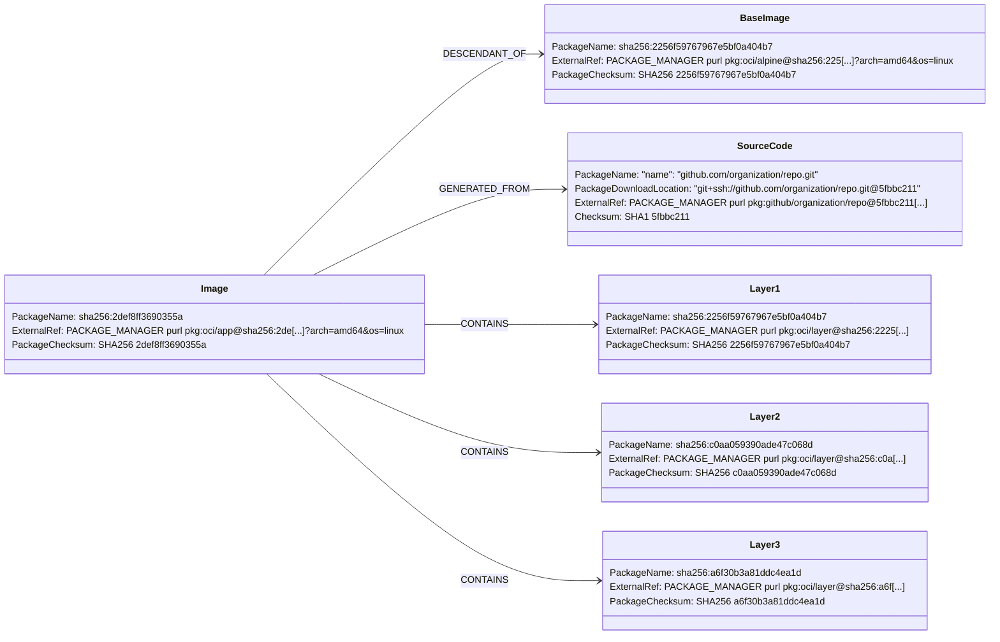

### Containers: Container Image

```mermaid
classDiagram
direction LR
class BaseImage {
  PackageName: sha256:2256f59767967e5bf0a404b7
  ExternalRef: PACKAGE_MANAGER purl pkg:oci/alpine@sha256:225[...]?arch=amd64&os=linux
  PackageChecksum: SHA256 2256f59767967e5bf0a404b7
}

class Image {
  PackageName: sha256:2def8ff3690355a
  ExternalRef: PACKAGE_MANAGER purl pkg:oci/app@sha256:2de[...]?arch=amd64&os=linux
  PackageChecksum: SHA256 2def8ff3690355a
}
class Layer1{
  PackageName: sha256:2256f59767967e5bf0a404b7
  ExternalRef: PACKAGE_MANAGER purl pkg:oci/layer@sha256:2225[...]
  PackageChecksum: SHA256 2256f59767967e5bf0a404b7
}
class Layer2 {
  PackageName: sha256:c0aa059390ade47c068d
  ExternalRef: PACKAGE_MANAGER purl pkg:oci/layer@sha256:c0a[...]
  PackageChecksum: SHA256 c0aa059390ade47c068d
}

class Layer3 {
  PackageName: sha256:a6f30b3a81ddc4ea1d
  ExternalRef: PACKAGE_MANAGER purl pkg:oci/layer@sha256:a6f[...]
  PackageChecksum: SHA256 a6f30b3a81ddc4ea1d
}

class SourceCode {
  PackageName: "name": "github.com/organization/repo.git"
  PackageDownloadLocation: "git+ssh://github.com/organization/repo.git@5fbbc211"
  ExternalRef: PACKAGE_MANAGER purl pkg:github/organization/repo@5fbbc211[...]
  Checksum: SHA1 5fbbc211
}

    Image --> BaseImage: DESCENDANT_OF
    Image --> SourceCode: GENERATED_FROM
    Image --> Layer1: CONTAINS
    Image --> Layer2: CONTAINS
    Image --> Layer3: CONTAINS

```