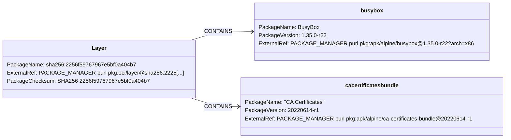

# Containers: Layer With Operating System Packages

## Design Goals

* Ensuring a layer is packaged by itself to allow reuse.
* Separation from other images to enable adding data about
OS packages and other lose files.

## Structure Diagram

## Design Specification

The goal of this design is to allow maximum flexibility when adding metadata
to the layer package. Generally, a layer abstracts a filesystem so it can
potentially contain anything. This is why the layer abstraction should have
room for current and unexpected uses.

### Package Structure

The package in this design represents a layer in a container image. Separating the
layers into their own packages ensures that adding data about packages can be added
to the appropiate section of the SBOM. For example, a layer can express an added file
via a `curl` pull while another can add child packages detailing the installed OS
dependencies.

Things inside of images should be added as SPDX Packages and Files and related using a
CONTAINS relationship. 

### Software Identifiers

The package representing a layer should have a purl of type `oci` referencing the 
layer in a registry-neutral way. No os/arch data needs be added to the purl as 
the layer will mostl likely live under an image SBOM which should include the platform
info. 
