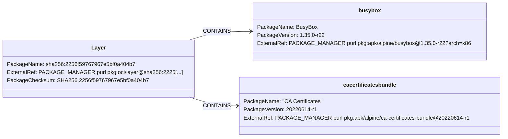

### Containers: Layer With Operating System Packages

```mermaid
classDiagram
direction LR

class Layer{
  PackageName: sha256:2256f59767967e5bf0a404b7
  ExternalRef: PACKAGE_MANAGER purl pkg:oci/layer@sha256:2225[...]
  PackageChecksum: SHA256 2256f59767967e5bf0a404b7
}

class busybox {
  PackageName: BusyBox
  PackageVersion: 1.35.0-r22
  ExternalRef: PACKAGE_MANAGER purl pkg:apk/alpine/busybox@1.35.0-r22?arch=x86
}

class cacertificatesbundle {
  PackageName: "CA Certificates"
  PackageVersion: 20220614-r1
  ExternalRef: PACKAGE_MANAGER purl pkg:apk/alpine/ca-certificates-bundle@20220614-r1
}

Layer --> busybox: CONTAINS

Layer --> cacertificatesbundle: CONTAINS
```
