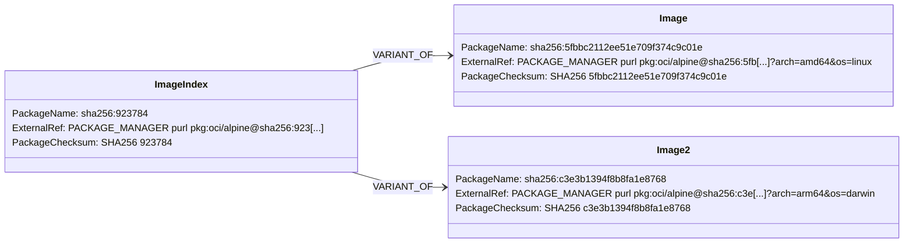

# Containers: MultiArch Image Index

```mermaid
classDiagram
  direction LR
class ImageIndex{
  PackageName: sha256:923784
  ExternalRef: PACKAGE_MANAGER purl pkg:oci/alpine@sha256:923[...]
  PackageChecksum: SHA256 923784
}
class Image{
  PackageName: sha256:5fbbc2112ee51e709f374c9c01e
  ExternalRef: PACKAGE_MANAGER purl pkg:oci/alpine@sha256:5fb[...]?arch=amd64&os=linux
  PackageChecksum: SHA256 5fbbc2112ee51e709f374c9c01e
}
class Image2 {
  PackageName: sha256:c3e3b1394f8b8fa1e8768
  ExternalRef: PACKAGE_MANAGER purl pkg:oci/alpine@sha256:c3e[...]?arch=arm64&os=darwin
  PackageChecksum: SHA256 c3e3b1394f8b8fa1e8768
}

    ImageIndex --> Image: VARIANT_OF
    ImageIndex --> Image2: VARIANT_OF
```
