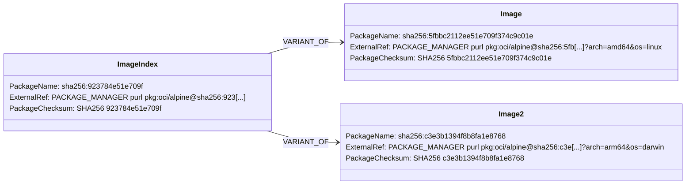

# Containers: MultiArch Image Index

## Design Goals

* Having an design through which an SBOM can represent the
structure of a container image index.
* Separation of single-arch images to allow referencing SBOMs
for each or adding a detailed structure for them in the packages
representing each image.
* No registry or repository information to ensure the SBOM is
portable across registries when images are copied around.
* Data detailing metadata about the single arch images is packaged
in the purl external reference.

## Structure Diagram

## Design Specification

### Package Structure

The top level package represents the image index. The name of the package should be
the digest of its manifest, preceded as usual by the algorithm,
eg `sha256:923784e51e709f...`.

Each container image fronted by the image must be represented by another package, also
named as its digest. Each of these packages should be related to the index using a 
`VARIANT_OF` SPDX relationship.

### Software Identifiers

Each of the packages in this design should contain a reference to the OCI object using
a [purl of type `oci`](https://github.com/package-url/purl-spec/blob/master/PURL-TYPES.rst#oci).
Packages representing the single arch images must contain the os/arch metadata and optionally
can add tag and repository metadata.
